# Steel Bike Run

<p align="center">
  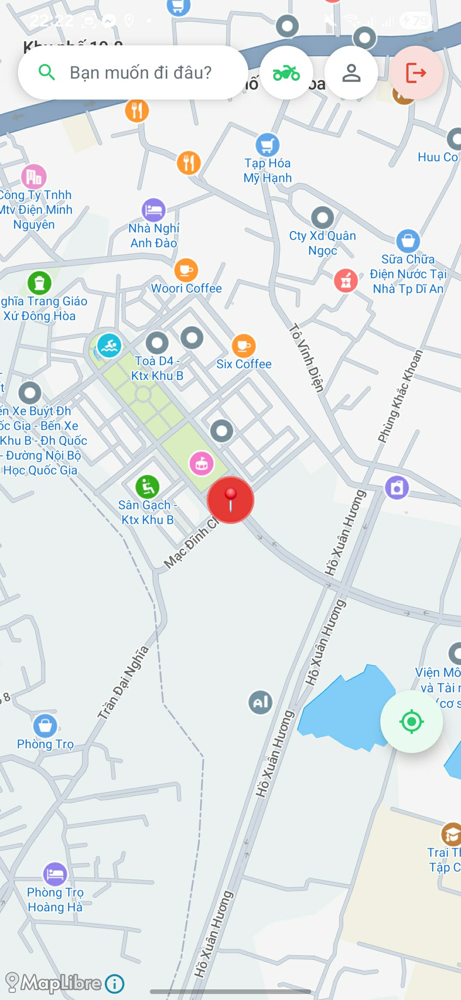
</p>

> **AI-Powered Ride-Hailing App with Drowsiness Detection**
> A ride-hailing platform that connects customers with drivers in real-time, featuring ML Kit-based face scanning to ensure driver alertness before accepting trips.

[](https://kotlinlang.org)
[](https://spring.io/projects/spring-boot)
[](https://www.postgresql.org)
[](https://redis.io)
[](https://developer.android.com/compose)
[](https://developers.google.com/ml-kit)
[](https://jwt.io)
[](https://h3geo.org)
[](./LICENSE)
[](http://localhost:8081/swagger-ui.html)

---

## Table of Contents

- [Steel Bike Run](#steel-bike-run)
  - [Table of Contents](#table-of-contents)
  - [1. About The Project](#1-about-the-project)
    - [Problem Statement](#problem-statement)
    - [Solution](#solution)
    - [Key Differentiator — AI Drowsiness Detection](#key-differentiator--ai-drowsiness-detection)
  - [2. Features](#2-features)
    - [Authentication](#authentication)
    - [Customer App](#customer-app)
    - [Driver App](#driver-app)
  - [3. API Reference](#3-api-reference)
    - [Authentication](#authentication)
    - [Driver APIs](#driver-apis)
    - [Trip APIs](#trip-apis)
    - [WebSocket (STOMP)](#websocket-stomp)
  - [4. Getting Started](#4-getting-started)
    - [Prerequisites](#prerequisites)
    - [Backend Setup](#backend-setup)
    - [Mobile Setup](#mobile-setup)
  - [5. License](#5-license)

---

## 1. About The Project

### Problem Statement

Road safety remains one of the most critical issues in ride-hailing services. A significant portion of accidents involving ride-hailing drivers is linked to fatigue and drowsiness — conditions that traditional apps have no mechanism to detect or prevent. At the same time, traditional ride-hailing apps suffer from:

- Slow driver-customer matching due to inefficient location indexing.
- Surge pricing that is either static or calculated without real-time demand data.
- Lack of real-time location tracking for both parties.
- No safeguards to verify driver alertness before or during a trip.

### Solution

**Steel Bike Run** is a full-stack ride-hailing application built to address these gaps. It provides a complete booking experience for customers while enforcing an AI-powered safety gate for drivers. The system uses **H3 hexagonal geospatial indexing** for sub-10ms driver-to-customer matching, a **write-behind Redis cache** for high-frequency location updates, and **ML Kit on-device face scanning** to detect drowsiness before every trip.

### Key Differentiator — AI Drowsiness Detection

Before a driver can go online and accept trips, they must pass a real-time **Eye Aspect Ratio (EAR)** calculation using Google ML Kit's face detection API. If drowsiness is detected, the driver is blocked from going online until they pass a re-scan. This feature runs entirely on-device — no network round-trip required.

<p align="center">
  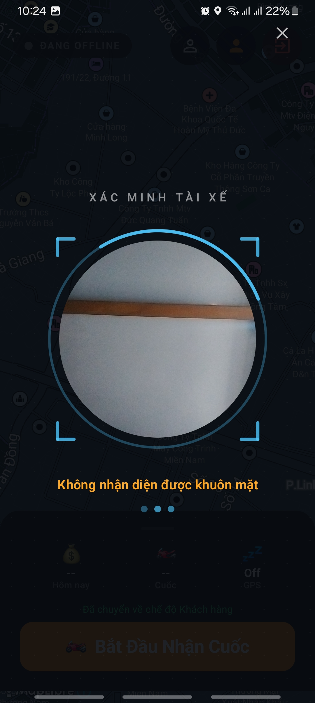
</p>

---

## 2. Features

### Authentication

Both customer and driver apps share the same authentication flow. Users register with their phone, email, and password, then log in to access their respective app features based on their assigned role.

| Login | Register |
|---|---|
| <p align="center">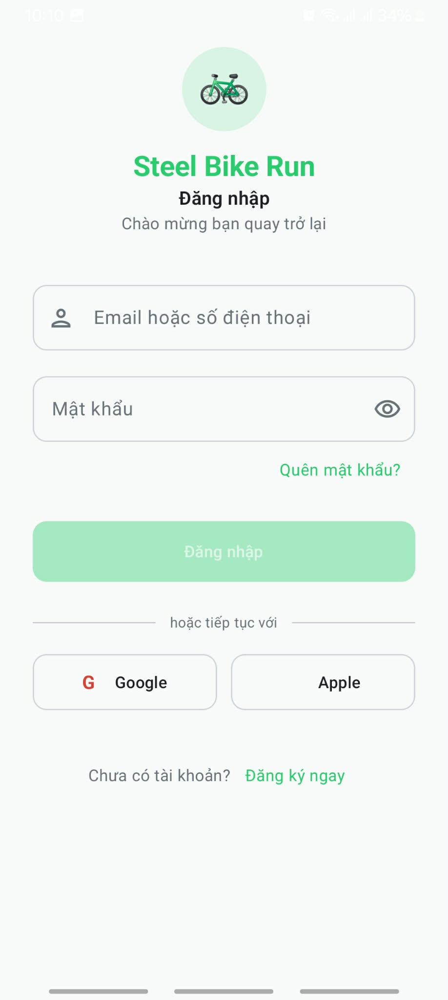</p> | <p align="center">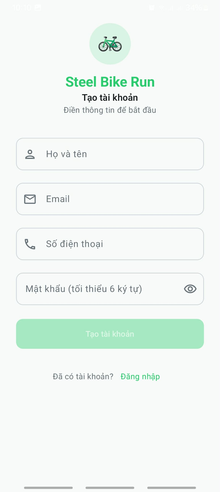</p> |

---

### Customer App

The customer app covers the full ride-hailing journey: from authentication to destination search, booking, real-time tracking, and trip completion.

#### 1. Search Destination

Customers enter their destination on an interactive map. The app displays available drivers nearby and provides a price estimate based on distance and surge pricing.

<p align="center">
  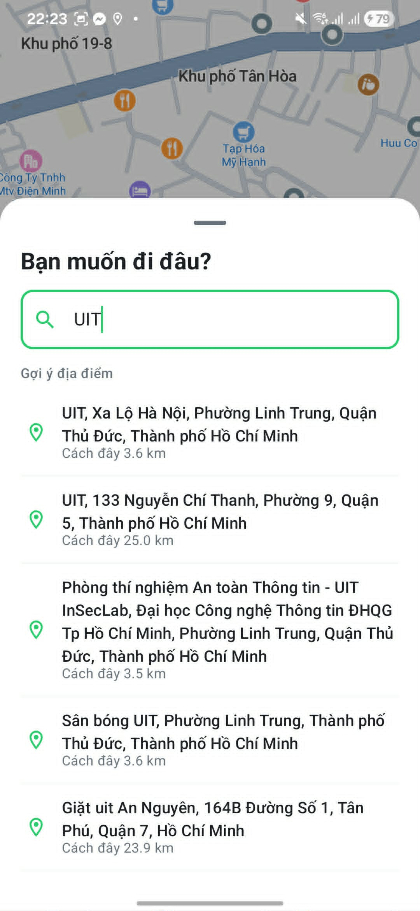
</p>

#### 2. Trip Details

Before confirming, the customer reviews trip details including pickup/dropoff locations, estimated fare, and driver information once matched.

<p align="center">
  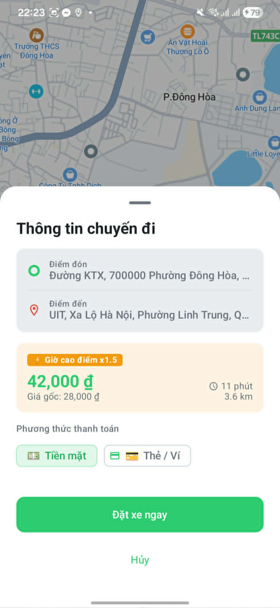
</p>

#### 3. Driver Assigned

Once a driver accepts the ride, the customer sees real-time driver info: name, vehicle, rating, and estimated time of arrival.

<p align="center">
  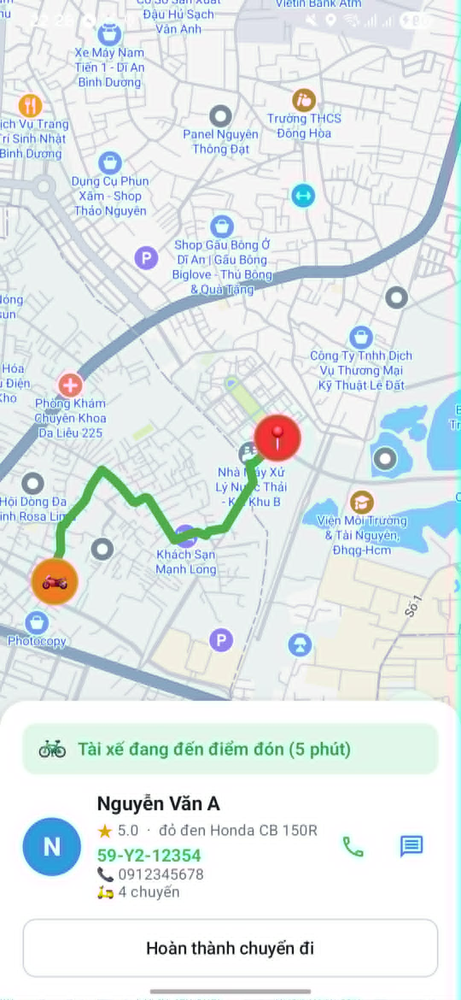
</p>

#### 4. Ride Tracking

Real-time tracking shows the driver's live location on the map as they navigate to the pickup point, with an estimated arrival countdown.

<p align="center">
  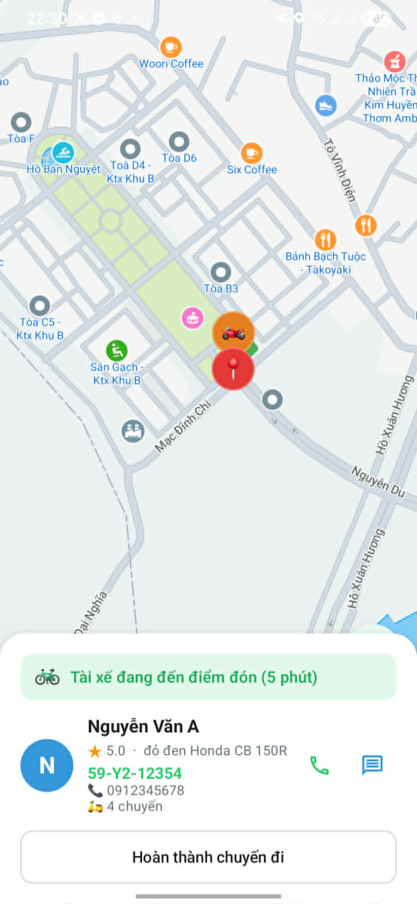
</p>

#### 5. Trip Ongoing

During the trip, the customer can monitor the route and trip progress in real-time via WebSocket updates from the driver.

<p align="center">
  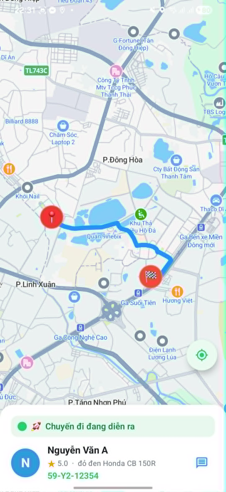
</p>

#### 6. Trip Completion

Upon arrival at the destination, the trip ends and the customer is prompted to rate the driver and leave a review.

<p align="center">
  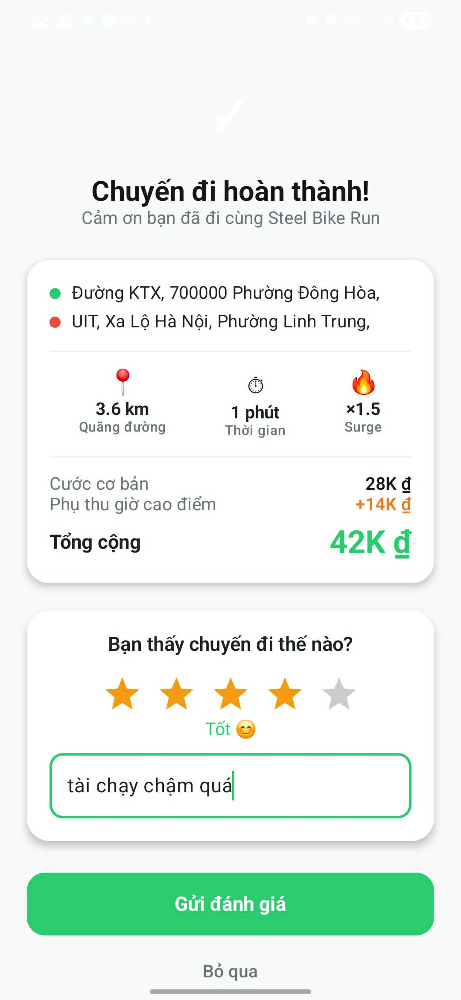
</p>

---

### Driver App

The driver app ensures safety through AI drowsiness detection before every shift, then handles trip requests, navigation, and trip lifecycle management.

#### 1. AI Drowsiness Detection (Safety Gate)

Before going online, the driver must pass a real-time **Eye Aspect Ratio (EAR)** scan using Google ML Kit. The camera detects facial landmarks and calculates EAR to determine alertness. If drowsy, the driver is blocked from accepting trips.

<p align="center">
  
</p>

#### 2. Driver Map View (Online / Offline)

Once the face scan passes, the driver sees an interactive map with their current location, toggle to switch between online and offline status, and nearby customer requests within their H3 zone.

<p align="center">
  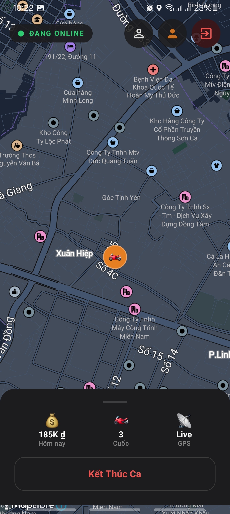
</p>

#### 3. New Trip Assignment

When a customer books a ride within the driver's zone, a trip request notification appears. The driver reviews pickup location, destination, and estimated fare before accepting.

<p align="center">
  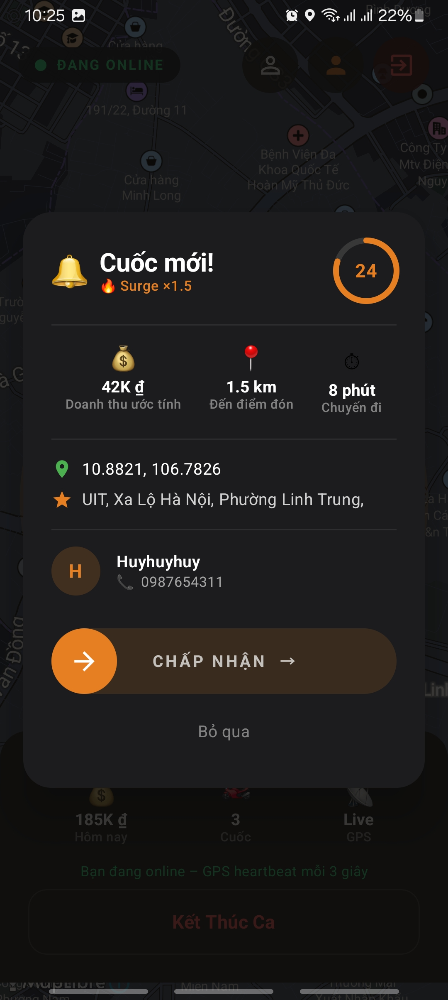
</p>

#### 3. Pick Up Passenger

After accepting, the driver navigates to the customer's pickup location. The app displays the customer's live location to guide the driver.

<p align="center">
  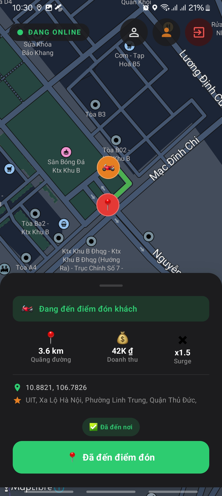
</p>

#### 4. Trip In Progress

Once the customer is aboard, the driver starts the trip. The app shows the destination and draws a navigation route from the current location to the drop-off point.

<p align="center">
  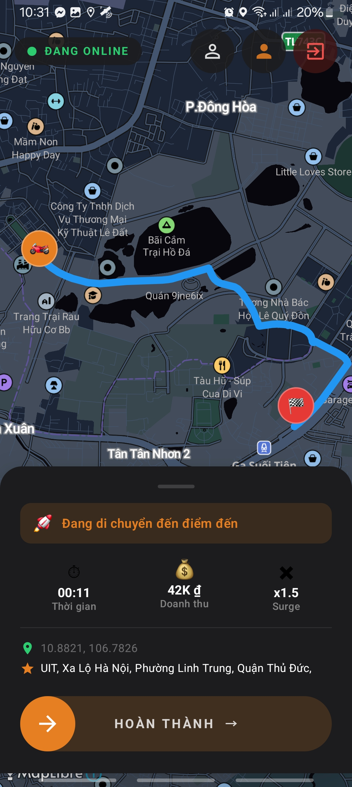
</p>

#### 5. Trip Assigned

The driver confirms trip acceptance and prepares for pickup. The system updates the customer's app in real-time with driver details and ETA.

<p align="center">
  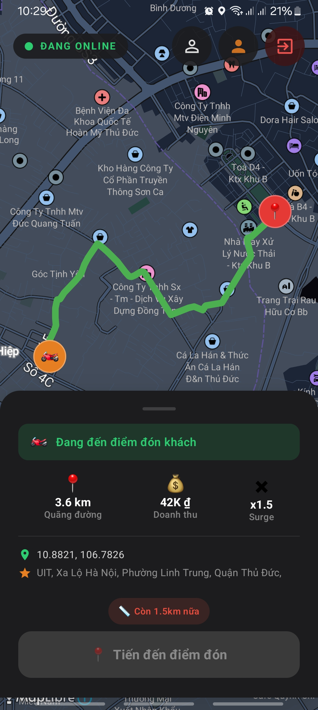
</p>

#### 6. Trip Completed

After the driver completes the trip, the fare is finalized and the customer is prompted to leave a rating and review.

<p align="center">
  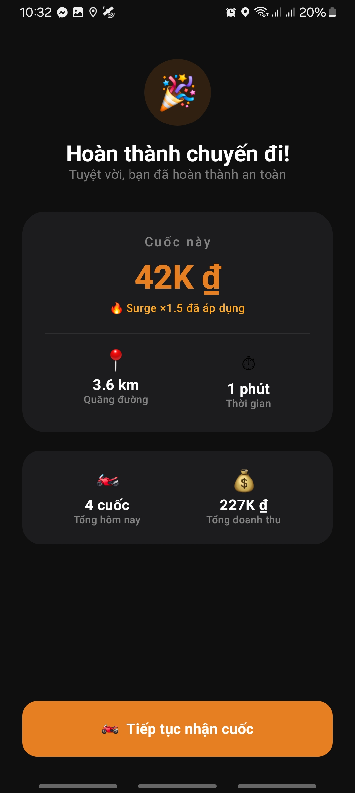
</p>

---

## 3. API Reference

Base URL: `http://localhost:8081`

> **Interactive API Docs:** Open `http://localhost:8081/swagger-ui.html` — click **Authorize** and enter your JWT token to test endpoints directly.

---

### Authentication

#### Register

```
POST /api/v1/auth/register
Content-Type: application/json

{
  "phone": "+84912345678",
  "email": "user@example.com",
  "password": "securePassword123",
  "fullName": "Nguyen Van A",
  "role": "CUSTOMER"        // CUSTOMER | DRIVER
}
```

#### Login

```
POST /api/v1/auth/login
Content-Type: application/json

{
  "phoneOrEmail": "+84912345678",
  "password": "securePassword123"
}
```

**Response:**

```json
{
  "accessToken": "eyJhbGciOiJIUzI1NiJ9...",
  "user": {
    "id": "uuid",
    "fullName": "Nguyen Van A",
    "role": "CUSTOMER"
  }
}
```

---

### Driver APIs

| Method | Endpoint | Role | Description |
|---|---|---|---|
| `PUT` | `/api/v1/driver/status` | DRIVER | Toggle online / offline |
| `POST` | `/api/v1/driver/location` | DRIVER | Update GPS location (heartbeat) |
| `GET` | `/api/v1/driver/nearby?lat=&lng=` | CUSTOMER | Find nearby drivers using H3 k-ring |

```
PUT /api/v1/driver/status
Authorization: Bearer <token>
Content-Type: application/json

{ "isOnline": true }
```

```
POST /api/v1/driver/location
Authorization: Bearer <token>
Content-Type: application/json

{
  "lat": 10.7769,
  "lng": 106.7009,
  "h3Index": "8a1c8b647ffffff"
}
```

---

### Trip APIs

| Method | Endpoint | Role | Description |
|---|---|---|---|
| `POST` | `/api/v1/trip/estimate` | CUSTOMER | Get price preview |
| `POST` | `/api/v1/trip` | CUSTOMER | Create a trip |
| `PUT` | `/api/v1/trip/{id}/accept` | DRIVER | Accept a trip |
| `PUT` | `/api/v1/trip/{id}/start` | DRIVER | Start the trip |
| `PUT` | `/api/v1/trip/{id}/complete` | DRIVER | Complete the trip |
| `GET` | `/api/v1/trip/{id}` | CUSTOMER/DRIVER | Get trip details |
| `GET` | `/api/v1/trip/history` | CUSTOMER/DRIVER | Get trip history |

```
POST /api/v1/trip/estimate
Authorization: Bearer <token>
Content-Type: application/json

{
  "pickupLat": 10.7769,
  "pickupLng": 106.7009,
  "destLat": 10.8231,
  "destLng": 106.6297
}
```

**Response:**

```json
{
  "basePrice": 25000,
  "surgeMultiplier": 1.2,
  "finalPrice": 30000,
  "distanceKm": 5.8,
  "durationMinutes": 12
}
```

---

### WebSocket (STOMP)

| Direction | Destination | Payload |
|---|---|---|
| SUBSCRIBE | `/topic/trip/{customerId}` | TripFoundMessage, DriverLocationUpdate |
| SUBSCRIBE | `/topic/driver/{driverId}` | NewTripRequest |
| SEND | `/app/driver.location` | LocationHeartbeat `{ lat, lng, heading, speed }` |

---

## 4. Getting Started

### Prerequisites

| Tool | Version | Purpose |
|---|---|---|
| **JDK** | 21+ | Runtime for Spring Boot backend |
| **Gradle** | 8.x | Build tool (or use Gradle Wrapper) |
| **Android Studio** | Ladybug+ | Mobile development |
| **PostgreSQL** | 15+ | Persistent data store |
| **Redis** | 7+ | Real-time location cache |

---

### Backend Setup

> **Note:** Make sure your PostgreSQL and Redis instances are running before starting the backend.

```bash
# 1. Navigate to the backend directory
cd Backend/SteelBikeRunBackend

# 2. Build the project
./gradlew build          # Linux/macOS
# gradlew.bat build      # Windows

# 3. Run the application
./gradlew bootRun        # Starts on port 8081

# Alternative: Run as JAR
./gradlew bootJar
java -jar build/libs/SteelBikeRunBackend-*.jar
```

**First-time setup (database migration):**

Flyway runs automatically on startup and applies all migrations under `src/main/resources/db/migration/`.

---

### Mobile Setup

```bash
# 1. Navigate to the mobile directory
cd Mobile/SteelBikeRun

# 2. Open in Android Studio
# File > Open > select Mobile/SteelBikeRun

# 3. Let Gradle sync all dependencies

# 4. Build and run on emulator or device
# Run > Run 'app'
```

---

## 5. License

This project is licensed under the **MIT License** — see the [LICENSE](./LICENSE) file for details.

---
