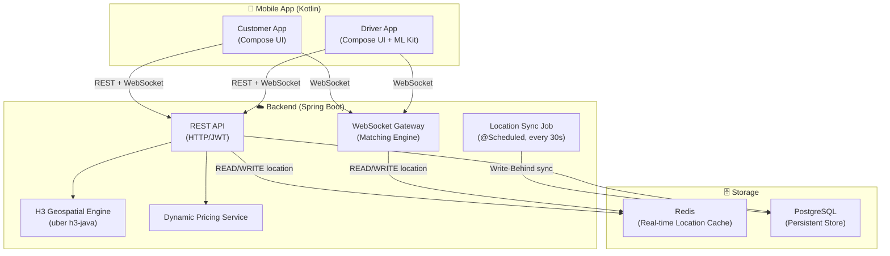
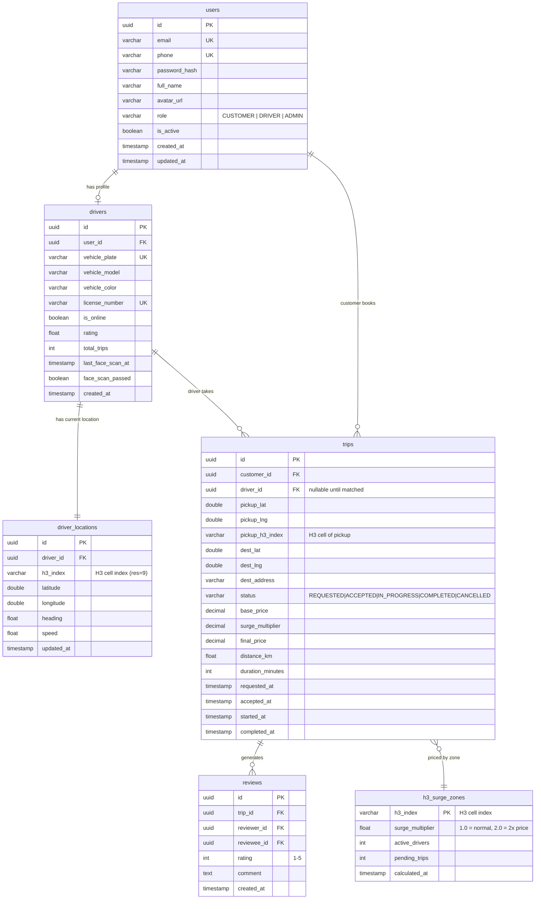
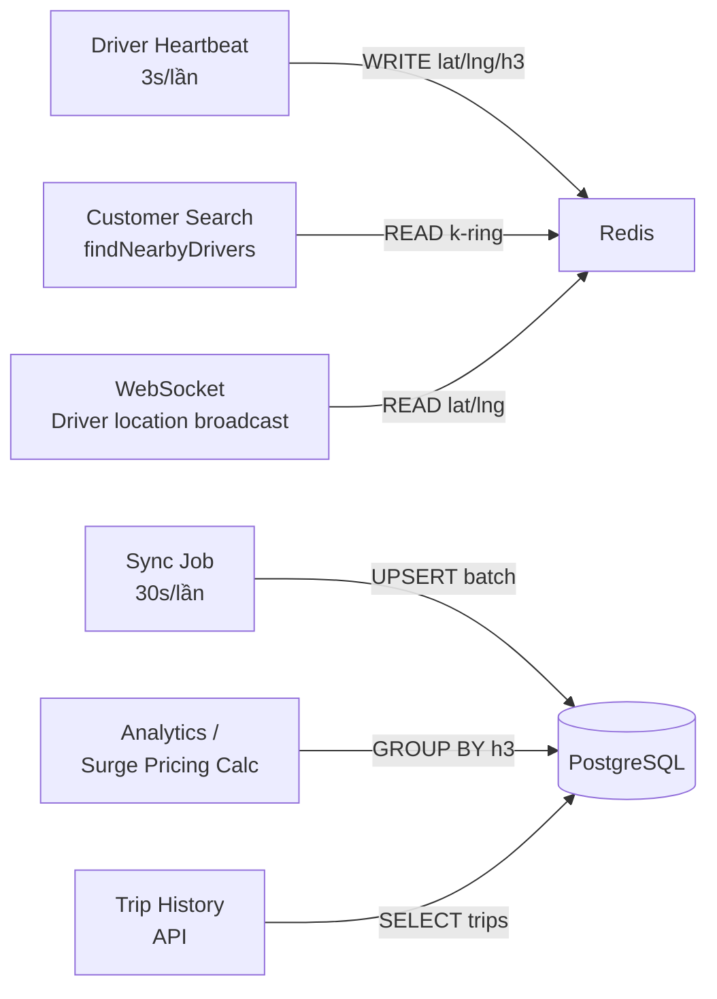

# H3-steelbike — System Architecture Blueprint

> **Dự án:** H3-steelbike MVP | **Team:** 2 người | **Timeline:** 6 tuần  
> **Stack:** Spring Boot 3.x · PostgreSQL · **Redis** · Kotlin · Jetpack Compose · ML Kit · H3

---

## 1. Tổng quan hệ thống & phân chia trách nhiệm



### 1.1 Backend chịu trách nhiệm
| Nhiệm vụ | Chi tiết |
|---|---|
| **Xác thực & Phân quyền** | JWT stateless, RBAC (CUSTOMER / DRIVER / ADMIN) |
| **Quản lý người dùng** | Đăng ký, đăng nhập, profile |
| **H3 Geospatial** | Index vị trí tài xế theo H3 cell, k-ring search tìm tài xế lân cận |
| **Dynamic Pricing** | Tính giá dựa trên mật độ tài xế trong H3 cell (surge pricing) |
| **Matching Engine** | WebSocket: nhận request → broadcast đến tài xế phù hợp → xác nhận |
| **Trip Management** | CRUD cuốc xe, trạng thái trip, lịch sử |
| **Redis Location Cache** | **Primary store** cho vị trí realtime: ghi/đọc cực nhanh (< 1ms) |
| **Write-Behind Sync** | Job định kỳ (30s) flush Redis → PostgreSQL, đảm bảo persistence |

### 1.2 Mobile chịu trách nhiệm
| Nhiệm vụ | Chi tiết |
|---|---|
| **UI toàn bộ** | Jetpack Compose, không XML layout |
| **AI Face Detection** | ML Kit On-device: EAR (Eye Aspect Ratio), phát hiện mệt mỏi |
| **Realtime Location** | GPS → coroutine Flow → gửi WebSocket heartbeat |
| **Map & H3 Overlay** | Google Maps SDK + vẽ hexagon H3 overlay |
| **Booking Flow** | Chọn điểm đến, xem giá preview, đặt xe |
| **Driver Flow** | Face scan → Online → nhận cuốc → navigation |

---

## 2. Kiến trúc Backend — Spring Boot

### 2.1 Lý do chọn Layered Architecture + DDD-lite

```
Tại sao KHÔNG chọn thuần Microservices?
→ MVP 2 tháng, team 2 người: overhead quá lớn.

Tại sao chọn Modular Monolith (DDD-lite)?
→ Tách module rõ ràng (user, trip, driver, pricing) nhưng deploy 1 JAR.
→ Dễ extract thành microservice sau nếu cần scale.
→ Code vẫn đạt chuẩn Clean Architecture, dễ test.
```

### 2.2 Cấu trúc thư mục Backend

```
h3-steelbike-backend/
├── src/main/java/com/h3steelbike/
│   ├── H3steelbikeApplication.java
│   │
│   ├── config/                          # Cross-cutting config
│   │   ├── SecurityConfig.java          # Spring Security + JWT filter chain
│   │   ├── WebSocketConfig.java         # STOMP WebSocket endpoints
│   │   ├── JwtConfig.java               # JWT secret, expiry properties
│   │   ├── H3Config.java                # H3 resolution config
│   │   ├── RedisConfig.java             # RedisTemplate, connection pool, TTL
│   │   └── SwaggerConfig.java           # OpenAPI 3.0 bean, JWT SecurityScheme, group APIs
│   │
│   ├── common/                          # Shared utilities
│   │   ├── exception/
│   │   │   ├── GlobalExceptionHandler.java   # @RestControllerAdvice
│   │   │   ├── AppException.java
│   │   │   └── ErrorCode.java           # Enum: USER_NOT_FOUND, TRIP_NOT_FOUND...
│   │   ├── response/
│   │   │   └── ApiResponse.java         # Generic wrapper {code, message, data}
│   │   ├── security/
│   │   │   ├── JwtUtil.java
│   │   │   ├── JwtAuthFilter.java       # OncePerRequestFilter
│   │   │   └── UserPrincipal.java
│   │   └── enums/
│   │       ├── UserRole.java            # CUSTOMER, DRIVER, ADMIN
│   │       └── TripStatus.java         # REQUESTED, ACCEPTED, IN_PROGRESS, COMPLETED, CANCELLED
│   │
│   ├── module/
│   │   ├── auth/
│   │   │   ├── controller/AuthController.java   # @Tag(name="Auth")
│   │   │   ├── service/AuthService.java
│   │   │   ├── dto/
│   │   │   │   ├── LoginRequest.java            # @Schema(description=...)
│   │   │   │   ├── RegisterRequest.java         # @Schema(description=...)
│   │   │   │   └── AuthResponse.java            # {accessToken, user}
│   │   │   └── AuthMapper.java
│   │   │
│   │   ├── user/
│   │   │   ├── controller/UserController.java   # @Tag(name="User")
│   │   │   ├── service/UserService.java
│   │   │   ├── repository/UserRepository.java
│   │   │   ├── entity/User.java                 # @Entity
│   │   │   └── dto/
│   │   │       ├── UserProfileResponse.java     # @Schema(description=...)
│   │   │       └── UpdateProfileRequest.java    # @Schema(description=...)
│   │   │
│   │   ├── driver/
│   │   │   ├── controller/DriverController.java # @Tag(name="Driver")
│   │   │   ├── service/DriverService.java
│   │   │   ├── service/DriverLocationService.java   # Orchestrator: Redis-first logic
│   │   │   ├── service/DriverLocationSyncJob.java   # @Scheduled: flush Redis → Postgres
│   │   │   ├── repository/DriverRepository.java
│   │   │   ├── repository/DriverLocationRepository.java  # JPA (Postgres)
│   │   │   ├── repository/DriverLocationRedisRepository.java  # Redis ops
│   │   │   ├── entity/Driver.java
│   │   │   ├── entity/DriverLocation.java           # JPA entity (Postgres)
│   │   │   ├── cache/DriverLocationCache.java       # Redis POJO (Serializable)
│   │   │   └── dto/
│   │   │       ├── DriverStatusRequest.java         # @Schema(description=...)
│   │   │       ├── LocationUpdateRequest.java       # @Schema(description=...)
│   │   │       └── NearbyDriverResponse.java        # @Schema(description=...)
│   │   │
│   │   ├── trip/
│   │   │   ├── controller/TripController.java   # @Tag(name="Trip")
│   │   │   ├── service/TripService.java
│   │   │   ├── service/PricingService.java      # Dynamic pricing với H3
│   │   │   ├── repository/TripRepository.java
│   │   │   ├── entity/Trip.java
│   │   │   └── dto/
│   │   │       ├── CreateTripRequest.java           # @Schema(description=...)
│   │   │       ├── TripResponse.java                # @Schema(description=...)
│   │   │       └── PriceEstimateResponse.java       # @Schema(description=...)
│   │   │
│   │   └── websocket/
│   │       ├── MatchingWebSocketController.java  # @Tag(name="WebSocket") - doc only
│   │       ├── MatchingService.java              # Core matching logic
│   │       ├── LocationWebSocketHandler.java     # Driver heartbeat
│   │       └── dto/
│   │           ├── TripRequestMessage.java
│   │           ├── DriverFoundMessage.java
│   │           └── LocationHeartbeat.java
│   │
├── src/main/resources/
│   ├── application.yml
│   ├── application-dev.yml
│   └── db/migration/                    # Flyway migrations
│       ├── V1__init_schema.sql
│       ├── V2__add_h3_indexes.sql
│       └── V3__seed_data.sql

├── pom.xml                              # springdoc-openapi-starter-webmvc-ui dep
│
└── src/test/java/com/h3steelbike/
    ├── module/auth/AuthServiceTest.java
    ├── module/trip/PricingServiceTest.java
    ├── module/driver/DriverLocationServiceTest.java
    └── integration/TripFlowIntegrationTest.java
```

### 2.3 Redis Data Structure Design

```
# Key schema trong Redis

driver:location:{driverId}          → HASH
    { lat, lng, h3Index, heading, speed, isOnline, updatedAt }
    TTL: 60s  (auto-expire nếu driver mất kết nối > 60s)

h3:drivers:{h3Index}                → SET of driverIds
    (tất cả driver đang online trong 1 H3 cell)
    TTL: 60s

# Tại sao dùng hai key riêng?
→ HASH: đọc toàn bộ thông tin 1 driver → O(1)
→ SET per H3 cell: k-ring search chỉ cần SUNION của 19 cells → O(N drivers)
→ Không cần scan toàn bộ keys
```

### 2.4 Flow quan trọng — H3 Driver Matching với Redis

```
[WRITE PATH] Driver gửi location heartbeat (WebSocket, mỗi 3s)
    → DriverLocationService.updateLocation(driverId, lat, lng)
    → h3Index = h3.latLngToCell(lat, lng, resolution=9)    // ~174m hexagon
    → Redis HSET driver:location:{driverId} {lat, lng, h3Index, ...} EX 60
    → Redis SADD h3:drivers:{h3Index} driverId             // thêm vào cell mới
    → Nếu h3Index thay đổi: Redis SREM h3:drivers:{oldH3} driverId  // xóa khỏi cell cũ
    ↳ (PostgreSQL KHÔNG được ghi ở đây → không blocking heartbeat)

[SYNC PATH] DriverLocationSyncJob — chạy mỗi 30 giây
    → Scan Redis keys: driver:location:*
    → Batch UPSERT vào bảng driver_locations (PostgreSQL)
    → PostgreSQL giữ lịch sử, dùng cho analytics / audit

[READ PATH] Customer đặt xe
    → h3.latLngToCell(pickupLat, pickupLng, res=9) → pickupH3
    → h3.gridDisk(pickupH3, k=2) → Set<String> searchArea  (19 hexagons)
    → Redis SUNION h3:drivers:{cell1} h3:drivers:{cell2} ... → Set<driverIds>
    → Redis HMGET driver:location:{id} cho từng driverId → lấy lat/lng đầy đủ
    → Sort by Haversine distance → Top 3 drivers
    → WebSocket broadcast TripRequestMessage → Driver app nhận

[DRIVER OFFLINE]
    → Redis DEL driver:location:{driverId}
    → Redis SREM h3:drivers:{h3Index} driverId
    → UPDATE drivers SET is_online=false (Postgres, ngay lập tức)
```

---

### 2.5 Swagger / OpenAPI Setup

> **Thư viện:** `springdoc-openapi-starter-webmvc-ui` v2.x (tương thích Spring Boot 3.x)  
> **KHÔNG dùng** Springfox (chỉ hỗ trợ đến Spring Boot 2.x)

#### Dependency (pom.xml)

```xml
<dependency>
    <groupId>org.springdoc</groupId>
    <artifactId>springdoc-openapi-starter-webmvc-ui</artifactId>
    <version>2.5.0</version>
</dependency>
```

#### SwaggerConfig.java — Cấu hình chính

```java
@Configuration
public class SwaggerConfig {

    @Bean
    public OpenAPI openAPI() {
        return new OpenAPI()
            .info(new Info()
                .title("H3-steelbike API")
                .description("Ride-hailing API với H3 Geospatial Indexing & AI Safety")
                .version("v1.0.0"))
            // Cho phép nhập JWT Bearer token trực tiếp trên Swagger UI
            .addSecurityItem(new SecurityRequirement().addList("bearerAuth"))
            .components(new Components()
                .addSecuritySchemes("bearerAuth",
                    new SecurityScheme()
                        .name("bearerAuth")
                        .type(SecurityScheme.Type.HTTP)
                        .scheme("bearer")
                        .bearerFormat("JWT")));
    }

    // Group API theo module — xuất hiện thành các tab riêng trên Swagger UI
    @Bean
    public GroupedOpenApi authGroup() {
        return GroupedOpenApi.builder()
            .group("1-auth").pathsToMatch("/api/v1/auth/**").build();
    }

    @Bean
    public GroupedOpenApi driverGroup() {
        return GroupedOpenApi.builder()
            .group("2-driver").pathsToMatch("/api/v1/driver/**").build();
    }

    @Bean
    public GroupedOpenApi tripGroup() {
        return GroupedOpenApi.builder()
            .group("3-trip").pathsToMatch("/api/v1/trip/**").build();
    }

    @Bean
    public GroupedOpenApi userGroup() {
        return GroupedOpenApi.builder()
            .group("4-user").pathsToMatch("/api/v1/user/**").build();
    }
}
```

#### Cách annotate Controller & DTO

```java
// Controller — dùng @Tag và @Operation
@Tag(name = "Trip", description = "Quản lý cuốc xe: đặt xe, xem giá, cập nhật trạng thái")
@RestController
@RequestMapping("/api/v1/trip")
public class TripController {

    @Operation(summary = "Ước tính giá chuyến đi",
               description = "Trả về giá cơ bản + surge multiplier theo vùng H3")
    @ApiResponses({
        @ApiResponse(responseCode = "200", description = "Ước tính thành công"),
        @ApiResponse(responseCode = "400", description = "Tọa độ không hợp lệ")
    })
    @PostMapping("/estimate")
    public ResponseEntity<ApiResponse<PriceEstimateResponse>> estimate(...) { ... }
}

// DTO — dùng @Schema
public record CreateTripRequest(
    @Schema(description = "Vĩ độ điểm đón", example = "10.7769")
    Double pickupLat,

    @Schema(description = "Kinh độ điểm đón", example = "106.7009")
    Double pickupLng,

    @Schema(description = "Địa chỉ điểm đến", example = "Sân bay Tân Sơn Nhất")
    String destAddress
) {}
```

#### application.yml — Swagger properties

```yaml
springdoc:
  swagger-ui:
    path: /swagger-ui.html          # URL truy cập: http://localhost:8080/swagger-ui.html
    tags-sorter: alpha
    operations-sorter: alpha
    display-request-duration: true
  api-docs:
    path: /v3/api-docs              # Raw OpenAPI JSON
  # Ẩn WebSocket endpoints (STOMP) khỏi Swagger (không support)
  paths-to-exclude: /app/**,/topic/**
```

#### Security — cấu hình cho phép Swagger bypass JWT filter

```java
// Trong SecurityConfig.java — thêm vào danh sách whitelist
.requestMatchers(
    "/swagger-ui/**",
    "/swagger-ui.html",
    "/v3/api-docs/**"
).permitAll()
```

> **Truy cập:** `http://localhost:8080/swagger-ui.html`  
> Nhấn **Authorize** → nhập `Bearer <token>` → test API trực tiếp có JWT.

---

## 3. Kiến trúc Mobile — Kotlin / Jetpack Compose

### 3.1 Lý do chọn MVVM + Clean Architecture

```
Tại sao Clean Architecture?
→ Tách biệt rõ: UI không biết về network/DB.
→ Domain layer testable hoàn toàn (pure Kotlin, không Android dependency).
→ UseCase = một nghiệp vụ cụ thể → dễ đọc, dễ test.

Tại sao MVVM (không MVI)?
→ Đủ đơn giản cho MVP 2 tháng.
→ StateFlow trong ViewModel → Compose collect tự nhiên.
→ MVI là overkill cho team nhỏ.
```

### 3.2 Cấu trúc thư mục Mobile

```
h3-steelbike-android/
└── app/src/main/java/com/h3steelbike/
    │
    ├── di/                              # Hilt Modules
    │   ├── NetworkModule.kt             # Retrofit, OkHttp, WebSocket
    │   ├── RepositoryModule.kt
    │   └── UseCaseModule.kt
    │
    ├── data/                            # DATA LAYER
    │   ├── remote/
    │   │   ├── api/
    │   │   │   ├── AuthApiService.kt    # Retrofit interface
    │   │   │   ├── TripApiService.kt
    │   │   │   └── DriverApiService.kt
    │   │   ├── websocket/
    │   │   │   ├── WebSocketManager.kt  # OkHttp WebSocket + Flow
    │   │   │   └── StompClient.kt       # STOMP protocol wrapper
    │   │   └── dto/                     # Network DTOs (mirror backend)
    │   │       ├── AuthDto.kt
    │   │       ├── TripDto.kt
    │   │       └── DriverDto.kt
    │   ├── local/
    │   │   ├── datastore/
    │   │   │   └── UserPreferencesDataStore.kt  # JWT token, user info
    │   │   └── entity/                  # Room entities (optional cache)
    │   └── repository/                  # Implementations
    │       ├── AuthRepositoryImpl.kt
    │       ├── TripRepositoryImpl.kt
    │       └── DriverRepositoryImpl.kt
    │
    ├── domain/                          # DOMAIN LAYER (pure Kotlin)
    │   ├── model/                       # Domain models (≠ DTOs)
    │   │   ├── User.kt
    │   │   ├── Trip.kt
    │   │   ├── Driver.kt
    │   │   └── LatLng.kt
    │   ├── repository/                  # Interfaces (contracts)
    │   │   ├── AuthRepository.kt
    │   │   ├── TripRepository.kt
    │   │   └── DriverRepository.kt
    │   └── usecase/
    │       ├── auth/
    │       │   ├── LoginUseCase.kt
    │       │   └── RegisterUseCase.kt
    │       ├── trip/
    │       │   ├── CreateTripUseCase.kt
    │       │   ├── GetPriceEstimateUseCase.kt
    │       │   └── ObserveTripStatusUseCase.kt  # Flow<TripStatus>
    │       ├── driver/
    │       │   ├── SetDriverOnlineUseCase.kt
    │       │   ├── AcceptTripUseCase.kt
    │       │   └── StreamLocationUseCase.kt     # Flow<LatLng> → WebSocket
    │       └── safety/
    │           └── FatigueDetectionUseCase.kt   # ML Kit wrapper
    │
    ├── presentation/                    # PRESENTATION LAYER
    │   ├── navigation/
    │   │   ├── AppNavGraph.kt           # NavHost, routes
    │   │   └── Screen.kt               # Sealed class routes
    │   │
    │   ├── screen/
    │   │   ├── auth/
    │   │   │   ├── LoginScreen.kt
    │   │   │   ├── LoginViewModel.kt
    │   │   │   ├── RegisterScreen.kt
    │   │   │   └── RegisterViewModel.kt
    │   │   │
    │   │   ├── customer/
    │   │   │   ├── home/
    │   │   │   │   ├── CustomerHomeScreen.kt    # Map + booking
    │   │   │   │   └── CustomerHomeViewModel.kt
    │   │   │   ├── booking/
    │   │   │   │   ├── BookingScreen.kt         # Chọn điểm đến, xem giá
    │   │   │   │   └── BookingViewModel.kt
    │   │   │   └── tracking/
    │   │   │       ├── TripTrackingScreen.kt    # Theo dõi tài xế realtime
    │   │   │       └── TripTrackingViewModel.kt
    │   │   │
    │   │   ├── driver/
    │   │   │   ├── home/
    │   │   │   │   ├── DriverHomeScreen.kt      # Map + status toggle
    │   │   │   │   └── DriverHomeViewModel.kt
    │   │   │   ├── facescan/
    │   │   │   │   ├── FaceScanScreen.kt        # CameraX + ML Kit
    │   │   │   │   └── FaceScanViewModel.kt     # EAR calculation
    │   │   │   └── trip/
    │   │   │       ├── DriverTripScreen.kt      # Nhận cuốc, navigation
    │   │   │       └── DriverTripViewModel.kt
    │   │   │
    │   │   └── shared/
    │   │       └── profile/
    │   │           ├── ProfileScreen.kt
    │   │           └── ProfileViewModel.kt
    │   │
    │   └── component/                   # Reusable Composables
    │       ├── MapComponent.kt          # GoogleMap + H3 overlay
    │       ├── H3HexagonOverlay.kt      # Draw hexagon polygons
    │       ├── LoadingButton.kt
    │       ├── AppTopBar.kt
    │       └── FaceScanCamera.kt        # CameraX preview composable
    │
    └── util/
        ├── H3Utils.kt                   # Client-side H3 helpers
        ├── LocationUtils.kt             # GPS + permission helpers
        ├── EarCalculator.kt             # Eye Aspect Ratio logic
        └── Extensions.kt
```

---

## 4. ERD — Database Design



### 4.1 Giải thích chi tiết từng bảng

#### `users` — Bảng gốc cho tất cả người dùng
| Cột | Lý do |
|---|---|
| `role` | RBAC: phân quyền API theo role, tránh customer gọi driver API |
| `is_active` | Soft-delete / ban tài khoản mà không xóa data |
| `phone` | Login bằng phone phổ biến hơn email ở Việt Nam |

#### `drivers` — Profile mở rộng của tài xế (1-1 với users)
| Cột | Lý do |
|---|---|
| `last_face_scan_at` / `face_scan_passed` | Tracking AI safety check, enforce policy |
| `is_online` | Toggle driver availability, filter khi matching |
| `rating` / `total_trips` | Denormalized để query nhanh, không cần JOIN reviews mỗi lần |
| `vehicle_*` | Thông tin xe hiển thị cho customer khi track |

#### `driver_locations` — **Persistent** location (PostgreSQL — KHÔNG còn là primary write target)
| Cột | Lý do |
|---|---|
| `h3_index` | Dùng cho analytics: thống kê vùng hot, surge pricing history |
| `updated_at` | Timestamp của lần sync gần nhất từ Redis (mỗi 30s) |
| Tách bảng riêng | Tần suất UPDATE vẫn cao (batch 30s), tránh lock bảng `drivers` |

> **Lưu ý kiến trúc:** Vị trí **realtime** sống trong **Redis**, PostgreSQL là lớp **persistence** sau khi sync. Khi cần tìm driver gần nhất → đọc Redis. Khi cần lịch sử / analytics → đọc Postgres.

#### `trips` — Cuốc xe
| Cột | Lý do |
|---|---|
| `pickup_h3_index` | Cho phép GROUP BY h3 để tính surge pricing |
| `surge_multiplier` | Snapshot giá tại thời điểm đặt, không bị ảnh hưởng sau này |
| `driver_id` nullable | Khi mới REQUESTED, chưa có driver |
| Các `*_at` timestamps | Audit trail đầy đủ, tính thời gian chờ, thời gian đi |

#### `h3_surge_zones` — Dynamic Pricing Cache
| Cột | Lý do |
|---|---|
| PK = `h3_index` | Upsert nhanh, query O(1) theo cell |
| `surge_multiplier` | Giá được tính trước theo batch, không real-time toán |
| `calculated_at` | Biết khi nào cần recalculate (mỗi 5 phút) |

> **Không có bảng refresh_token** (theo yêu cầu). JWT short-lived (1h), client phải re-login.

### 4.2 Indexes quan trọng

```sql
-- driver_locations: chỉ dùng cho sync job và analytics (query nguội)
CREATE INDEX idx_driver_locations_h3 ON driver_locations(h3_index);
CREATE INDEX idx_driver_locations_updated ON driver_locations(updated_at);

-- Lịch sử trip của user
CREATE INDEX idx_trips_customer ON trips(customer_id, requested_at DESC);
CREATE INDEX idx_trips_driver ON trips(driver_id, requested_at DESC);
CREATE INDEX idx_trips_status ON trips(status) WHERE status IN ('REQUESTED', 'ACCEPTED', 'IN_PROGRESS');
```

### 4.3 Redis Configuration (application.yml)

```yaml
spring:
  data:
    redis:
      host: localhost
      port: 6379
      timeout: 2000ms
      lettuce:
        pool:
          max-active: 20
          max-idle: 10

h3steelbike:
  redis:
    driver-location-ttl: 60        # seconds — auto-expire nếu mất kết nối
    h3-cell-ttl: 60                # seconds
  sync:
    location-interval-ms: 30000   # 30s — flush Redis → Postgres
```

---

## 5. Kế hoạch 6 tuần — Team 2 người

> **Phân công:** Dev A = Backend | Dev B = Mobile  
> (Tuần 3-4 cross-support, tuần 5-6 integration)

### Tuần 1: Foundation (Ngày 1–7)

| Dev A — Backend | Dev B — Mobile |
|---|---|
| Setup Spring Boot project, Flyway migrations | Setup Android project, Hilt, Compose nav |
| Implement `users`, `drivers` entities + repo | Implement DataStore (JWT storage) |
| Auth API: Register, Login (JWT) | Auth UI: Login Screen, Register Screen |
| Spring Security config, JWT filter | Retrofit setup, Auth API calls |
| **Deliverable:** Auth endpoints working + Postman tested | **Deliverable:** Login/Register flow hoàn chỉnh |

### Tuần 2: Core Domain (Ngày 8–14)

| Dev A — Backend | Dev B — Mobile |
|---|---|
| Driver module: profile, `is_online` toggle | Driver Home Screen (Map + toggle online) |
| **Redis setup**: `DriverLocationRedisRepository`, key schema | GPS location stream (Flow + coroutine) |
| `driver_locations` PostgreSQL table + **Sync Job** | WebSocket client setup (STOMP) |
| H3 k-ring search: `findNearbyDrivers()` đọc từ Redis | Customer Home Screen + booking UI |
| `h3_surge_zones` + PricingService | Display H3 surge zones trên map |
| **Deliverable:** Driver heartbeat → Redis, Customer query Redis tìm driver | **Deliverable:** Map hiển thị drivers, customer chọn điểm đến |

### Tuần 3: AI Safety + Matching (Ngày 15–21)

| Dev A — Backend | Dev B — Mobile |
|---|---|
| WebSocket Matching Engine (STOMP) | ML Kit Face Detection + CameraX |
| Trip lifecycle: REQUESTED → ACCEPTED | EAR Calculator (Eye Aspect Ratio) |
| Driver heartbeat WebSocket handler | FaceScanScreen + FaceScanViewModel |
| Trip status WebSocket broadcast | FaceScan gate trước khi Driver Online |
| **Deliverable:** Trip matching qua WebSocket | **Deliverable:** AI face scan functional |

### Tuần 4: Trip Flow + Tracking (Ngày 22–28)

| Dev A — Backend | Dev B — Mobile |
|---|---|
| Trip status machine hoàn chỉnh | Driver Trip Screen (nhận cuốc, navigation) |
| Location tracking API (driver → server) | Customer Trip Tracking Screen (realtime) |
| Trip complete + pricing final | Review UI sau trip |
| Reviews API | H3 Hexagon Overlay on map (surge zones) |
| **Deliverable:** End-to-end trip flow từ đặt đến hoàn thành | **Deliverable:** Customer track driver realtime |

### Tuần 5: Polish + Integration (Ngày 29–37)

| Cả team cùng làm |
|---|
| Integration testing: Mobile ↔ Backend full flow |
| Error handling toàn diện (network errors, edge cases) |
| UI Polish: loading states, empty states, animations |
| Performance: test với nhiều driver concurrent (WebSocket load) |
| Security review: kiểm tra RBAC từng API |
| Fix bugs phát sinh từ integration |

### Tuần 6: Demo Prep + Buffer (Ngày 38–42)

| Cả team cùng làm |
|---|
| Demo data seeding (realistic data) |
| Screen recording / demo script |
| Documentation: README, API docs (Swagger) |
| Buffer cho bugs cuối cùng |
| **Deliverable cuối:** App hoạt động end-to-end, demo-ready |

---

## 6. API Contract chính (Backend ↔ Mobile)

```
Authentication
POST /api/v1/auth/register        { phone, email, password, fullName, role }
POST /api/v1/auth/login           { phone/email, password } → { accessToken, user }

Driver
PUT  /api/v1/driver/status        { isOnline } [DRIVER]
POST /api/v1/driver/location      { lat, lng, h3Index } [DRIVER]
GET  /api/v1/driver/nearby?lat=&lng= [CUSTOMER]

Trip
POST /api/v1/trip/estimate        { pickupLat, pickupLng, destLat, destLng }
POST /api/v1/trip                 { pickupLat, pickupLng, destLat, destLng, destAddress } [CUSTOMER]
PUT  /api/v1/trip/{id}/accept     [DRIVER]
PUT  /api/v1/trip/{id}/start      [DRIVER]
PUT  /api/v1/trip/{id}/complete   [DRIVER]
GET  /api/v1/trip/{id}            [CUSTOMER|DRIVER]
GET  /api/v1/trip/history         [CUSTOMER|DRIVER]

WebSocket (STOMP)
SUBSCRIBE /topic/trip/{customerId}    → TripFoundMessage, DriverLocationUpdate
SUBSCRIBE /topic/driver/{driverId}    → NewTripRequest
SEND      /app/driver.location        → LocationHeartbeat { lat, lng }
```

---

## 7. Rủi ro & Mitigation

| Rủi ro | Khả năng | Mitigation |
|---|---|---|
| Redis down → mất location data | Thấp | TTL + PostgreSQL là fallback; Redis persistence (AOF) bật trong prod |
| Redis & Postgres out-of-sync | Trung bình | Sync job idempotent (UPSERT ON CONFLICT); log mọi sync failure |
| WebSocket scaling | Thấp (MVP) | Dùng in-memory broker; Redis đã sẵn → dễ thêm Redis pub/sub sau |
| ML Kit accuracy | Trung bình | Thêm manual override cho demo |
| GPS accuracy indoor | Cao | Disclaimer trong demo |
| Team bottleneck ở integration | Trung bình | Mock API early (Postman mock / WireMock) |
| H3 resolution sai | Thấp | Test unit PricingService với nhiều resolution |

---

## 8. Redis vs PostgreSQL — Khi nào đọc/ghi ở đâu



| Operation | Store | Lý do |
|---|---|---|
| Driver heartbeat (write) | **Redis only** | < 1ms, không block WebSocket |
| Find nearby drivers (read) | **Redis only** | SUNION 19 cells ~ 0.1ms |
| Driver location broadcast (read) | **Redis only** | Tươi nhất, sub-3s |
| Sync driver location | **Postgres** | Batch 30s, persistence |
| Trip CRUD | **Postgres** | Relational, cần ACID |
| Surge pricing calculation | **Postgres** | Cần GROUP BY, aggregation |
| User auth | **Postgres** | Persistent, security-critical |
